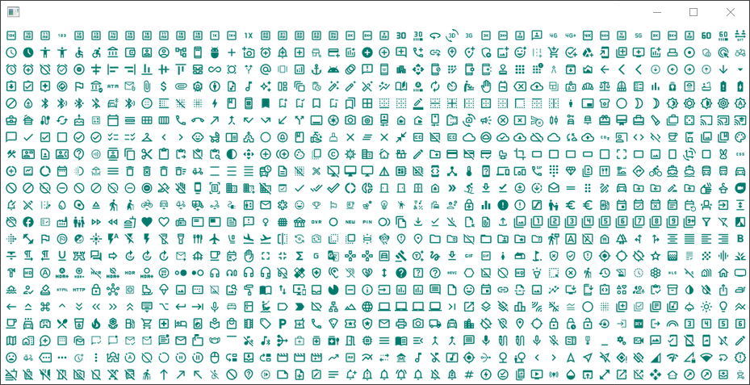

# swt-material-icons

This package wraps the [Google material design icons](https://github.com/google/material-design-icons)
into a Java library so that these can be used in an [SWT](https://www.eclipse.org/swt/)
application. The icons are scaled down to 16x16 pixels as this size seems to
work best in an Eclipse RCP application.

## Usage

An SWT image of an icon can be created via:

```java
var image = MaterialIcon.LOCK.baseline().image(display);
```

Note that nothing is cached, and you need to dispose the image if it is not
needed anymore. The best way is to use the icons with a jface `ImageRegistry`.
Each icon has 4 variants (`baseline`, `outline`, `sharp`, `round`) and each
icon variant has a unique name:

```java
MaterialIcon.LOCK.outline().name();
```

You can also just use raw image data and apply a color on the icon:

```java
MaterialIcon.LAPTOP.outline().data(new RGB(114, 252, 178));
```

See also the [Example](./src/test/java/org/openlca/swt/material/icons/Example.java)
which produces a shell like this:



or with dark background:


